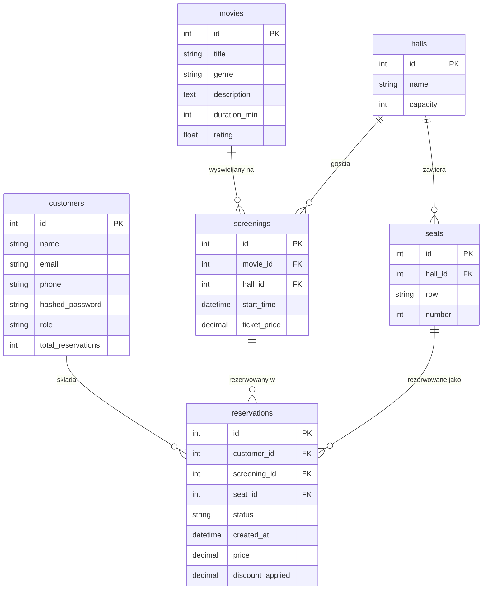
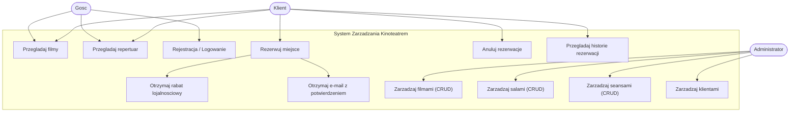

# Dokumentacja techniczna — System Zarządzania Kinoteatrem

## 1. Opis tematu i funkcjonalności systemu

System Zarządzania Kinoteatrem to aplikacja webowa wspierająca codzienną pracę
kina oraz obsługę klientów. System pozwala przeglądać repertuar, rezerwować
konkretne miejsca na seansach, anulować rezerwacje oraz zarządzać danymi kina
(filmy, sale, seanse). Dla stałych klientów naliczany jest rabat lojalnościowy,
a po dokonaniu rezerwacji na adres e-mail klienta wysyłane jest potwierdzenie.

### Aktorzy

- **Gość** — użytkownik niezalogowany; może przeglądać filmy i repertuar.
- **Klient** — użytkownik zalogowany; może rezerwować i anulować miejsca,
  przeglądać historię swoich rezerwacji oraz korzystać z rabatu lojalnościowego.
- **Administrator** — zarządza filmami, salami, seansami oraz klientami.

### Główne funkcjonalności

- Rejestracja i logowanie (uwierzytelnianie tokenem JWT).
- Przeglądanie listy filmów wraz z opisem, gatunkiem, czasem trwania i oceną.
- Przeglądanie repertuaru (seanse: film, sala, data, cena biletu).
- Rezerwacja miejsca z graficznym wyborem fotela (mapa sali).
- Blokada podwójnej rezerwacji tego samego miejsca na danym seansie.
- Rabat lojalnościowy: klient z co najmniej 5 potwierdzonymi rezerwacjami
  otrzymuje 10% zniżki na kolejny bilet.
- Anulowanie rezerwacji (miejsce ponownie staje się dostępne).
- Wysyłka wiadomości e-mail z potwierdzeniem rezerwacji.
- Panel administratora z pełnym CRUD dla filmów, sal i seansów.

## 2. Opis stosu technologicznego

| Warstwa        | Technologia                                        | Uzasadnienie |
| -------------- | -------------------------------------------------- | ------------ |
| Back-end       | Python 3.12 + FastAPI                              | Nowoczesny, wydajny framework asynchroniczny z automatyczną dokumentacją OpenAPI/Swagger. |
| ORM            | SQLAlchemy 2.0                                      | Dojrzały mapper obiektowo-relacyjny; obsługa operacji CRUD bez pisania SQL. |
| Migracje       | Alembic                                             | Wersjonowanie schematu bazy danych. |
| Baza danych    | PostgreSQL 16                                        | Wydajna, otwarta relacyjna baza danych. |
| Front-end      | React 18 + Vite + React Router + Axios              | Komponentowy interfejs SPA, szybki bundler, prosta obsługa tras i zapytań HTTP. |
| Autoryzacja    | JWT (python-jose) + passlib (pbkdf2_sha256)         | Bezstanowe uwierzytelnianie i bezpieczne haszowanie haseł. |
| E-mail         | fastapi-mail                                        | Wysyłka wiadomości SMTP w tle. |
| Konteneryzacja | Docker + Docker Compose                             | Powtarzalne środowisko uruchomieniowe (baza + API + front). |
| Testy          | pytest + behave (Gherkin)                           | Testy jednostkowe/integracyjne oraz akceptacyjne w języku naturalnym. |

Aplikacja jest podzielona na dwa niezależne projekty: `backend/` oraz
`frontend/`, komunikujące się poprzez REST API (JSON).

## 3. Jak uruchomić aplikację

Szczegółowa instrukcja znajduje się w pliku [README.md](../README.md).
Skrótowo (Docker):

```bash
copy .env.example .env
docker compose up --build
```

- Front-end: http://localhost:3000
- API + Swagger: http://localhost:8000/docs

## 4. Diagram bazy danych



### Opis tabel

- **customers** — klienci i administratorzy (pole `role`). `total_reservations`
  przechowuje liczbę potwierdzonych rezerwacji (podstawa rabatu lojalnościowego).
- **movies** — filmy dostępne w repertuarze.
- **halls** — sale kinowe wraz z pojemnością.
- **seats** — pojedyncze miejsca w sali (`row` + `number`), unikalne w ramach sali.
- **screenings** — seanse: powiązanie filmu z salą, data oraz cena biletu.
- **reservations** — rezerwacje: powiązanie klienta, seansu i miejsca; przechowuje
  status, cenę końcową i zastosowany rabat.

## 5. Diagram UML przypadków użycia



### Przykładowy opis przypadku użycia

- **Nazwa:** Rezerwacja miejsca na seansie.
- **Opis:** Zalogowany klient rezerwuje wolne miejsce na wybranym seansie.
- **Warunki wstępne:** Klient jest zalogowany; istnieje seans z co najmniej
  jednym wolnym miejscem.
- **Przepływ zdarzeń:**
  1. Klient wybiera seans z repertuaru.
  2. System wyświetla mapę sali z wolnymi miejscami.
  3. Klient wybiera miejsce i zatwierdza rezerwację.
  4. System sprawdza dostępność miejsca i nalicza ewentualny rabat.
  5. System tworzy rezerwację i wysyła e-mail z potwierdzeniem.
- **Warunki końcowe:** Rezerwacja ma status „confirmed”, miejsce jest zajęte,
  a licznik rezerwacji klienta zostaje zwiększony.
- **Scenariusz alternatywny:** Jeśli miejsce jest już zajęte, system odrzuca
  rezerwację i wyświetla komunikat błędu.

## 6. Opis interfejsu użytkownika

Interfejs to aplikacja jednostronicowa (SPA) w ciemnej kolorystyce inspirowanej
platformami streamingowymi. Nawigacja odbywa się przez górny pasek (Navbar).

- **Strona główna** — sekcja powitalna z odnośnikami do filmów i repertuaru.
- **Filmy** — siatka kart z tytułem, gatunkiem, czasem trwania, oceną i opisem.
- **Repertuar (Seanse)** — karty seansów z datą, salą i ceną; przycisk „Rezerwuj”
  (dla niezalogowanych — zachęta do logowania).
- **Rezerwacja** — graficzna mapa sali; miejsca zajęte są nieaktywne, wybrane
  podświetlone. Po rezerwacji wyświetlany jest komunikat sukcesu.
- **Moje rezerwacje** — tabela rezerwacji klienta z możliwością anulowania oraz
  informacją o zastosowanym rabacie.
- **Logowanie / Rejestracja** — proste formularze z obsługą błędów.
- **Panel administratora** — widok z zakładkami (Filmy / Sale / Seanse), każdy
  z formularzem dodawania i tabelą z możliwością usuwania rekordów. Trasa
  chroniona — dostępna wyłącznie dla roli `admin`.

Elementy wspólne: przyciski (`.btn`), karty (`.card`), tabele, formularze i
komunikaty (`.alert`). Trasy wymagające logowania chronione są komponentem
`ProtectedRoute`.

## 7. Opis kluczowych elementów back-endu

Struktura back-endu (warstwowa):

```
backend/app/
├── main.py        # inicjalizacja FastAPI, CORS, rejestracja routerów
├── core/          # konfiguracja, bezpieczeństwo (JWT/hasła), e-mail
├── db/            # połączenie z bazą, deklaratywna baza modeli, seed
├── models/        # modele ORM (SQLAlchemy)
├── schemas/       # schematy Pydantic (walidacja i serializacja DTO)
├── crud/          # logika dostępu do danych i reguły biznesowe
├── routers/       # endpointy REST (auth, movies, halls, screenings, ...)
└── deps.py        # zależności FastAPI (bieżący użytkownik, wymóg admina)
```

Kluczowe elementy:

- **Uwierzytelnianie (JWT):** `core/security.py` generuje i weryfikuje tokeny,
  a `deps.py` udostępnia zależności `get_current_user` oraz `require_admin`,
  które zabezpieczają endpointy.
- **Operacje CRUD przez ORM:** warstwa `crud/` korzysta z SQLAlchemy do tworzenia,
  odczytu, aktualizacji i usuwania rekordów, bez ręcznego pisania SQL.
- **Reguły biznesowe rezerwacji** (`crud/reservation.py`):
  - `is_seat_available` — sprawdza, czy dane miejsce nie ma już potwierdzonej
    rezerwacji na tym seansie.
  - `calculate_price` / `discount_rate_for` — nalicza rabat lojalnościowy (10%
    dla klientów z co najmniej 5 rezerwacjami).
  - `create_reservation` — waliduje zgodność miejsca z salą seansu, dostępność
    miejsca, nalicza cenę i zwiększa licznik rezerwacji klienta.
  - `cancel_reservation` — ustawia status „cancelled” i zwalnia miejsce.
- **Wysyłka e-mail:** po utworzeniu rezerwacji endpoint dodaje zadanie w tle
  (`BackgroundTasks`), które wysyła wiadomość HTML z potwierdzeniem.
- **Migracje (Alembic):** schemat bazy jest wersjonowany; migracja `0001_initial`
  tworzy wszystkie tabele.

## 8. Przypadki testowe

Projekt zawiera testy jednostkowe/integracyjne (pytest) oraz akceptacyjne
w języku **Gherkin** (behave). Uruchomienie:

```bash
cd backend
pytest -q
behave tests/features
```

### Testy pytest

- `tests/test_crud.py` — logika rabatu, dostępność miejsc, blokada podwójnej
  rezerwacji, anulowanie zwalniające miejsce.
- `tests/test_api.py` — rejestracja/logowanie, publiczna lista filmów, ochrona
  endpointów administratora, pełny przepływ rezerwacji.

### Scenariusze Gherkin (`tests/features/reservation.feature`)

```gherkin
Feature: Making a reservation

  Scenario: Customer reserves an available seat
    Given a screening exists for movie "Inception" priced at 30 PLN
    And seat "A1" is available
    When customer "Jan Kowalski" reserves seat "A1"
    Then the reservation is created with status "confirmed"
    And the reservation price is 30.00 PLN

  Scenario: Seat cannot be double-booked
    Given a screening exists for movie "Inception" priced at 30 PLN
    And seat "A1" is available
    When customer "Jan Kowalski" reserves seat "A1"
    And customer "Anna Nowak" tries to reserve seat "A1"
    Then the second reservation is rejected

  Scenario: Loyal customer gets a discount
    Given a screening exists for movie "Inception" priced at 30 PLN
    And customer "Jan Kowalski" already has 5 confirmed reservations
    When customer "Jan Kowalski" reserves seat "B2"
    Then the reservation price is 27.00 PLN
    And a discount of 10 percent is applied

  Scenario: Cancelling a reservation frees the seat
    Given a screening exists for movie "Inception" priced at 30 PLN
    And seat "A1" is available
    When customer "Jan Kowalski" reserves seat "A1"
    And customer "Jan Kowalski" cancels the reservation
    Then seat "A1" is available again
```

## 9. Literatura

1. Dokumentacja FastAPI — https://fastapi.tiangolo.com/
2. Dokumentacja SQLAlchemy 2.0 — https://docs.sqlalchemy.org/en/20/
3. Dokumentacja Alembic — https://alembic.sqlalchemy.org/
4. Dokumentacja React — https://react.dev/
5. Dokumentacja Vite — https://vite.dev/
6. Dokumentacja PostgreSQL 16 — https://www.postgresql.org/docs/16/
7. Dokumentacja Docker Compose — https://docs.docker.com/compose/
8. Dokumentacja Pydantic — https://docs.pydantic.dev/
9. fastapi-mail — https://sabuhish.github.io/fastapi-mail/
10. behave (Gherkin/BDD) — https://behave.readthedocs.io/
11. M. Fowler, „UML Distilled”, wyd. Helion.
```
