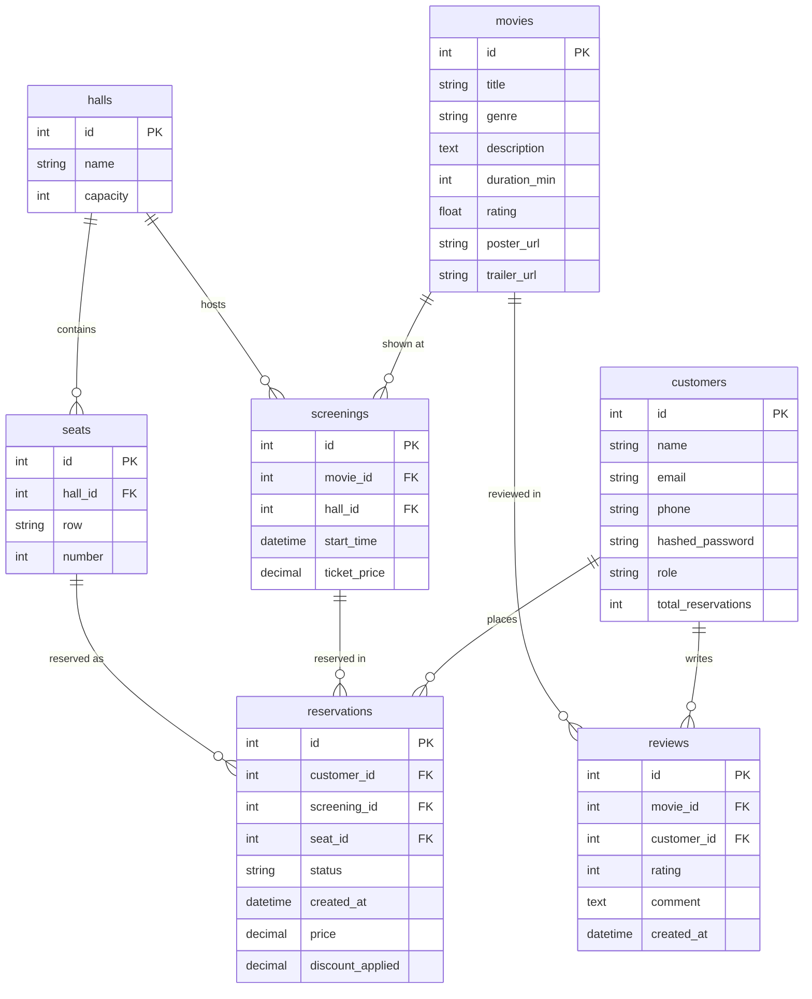

# Technical Documentation — Cinema Management System

## 1. System overview and functionality

The Cinema Management System ("System Zarządzania Kinoteatrem") is a web
application that supports the day-to-day operation of a cinema and the handling
of its customers. The system lets users browse the schedule, reserve specific
seats for screenings, cancel reservations, and manage cinema data (films, halls,
screenings). Returning customers earn a loyalty discount, and after a booking a
confirmation email is sent to the customer's address.

> **Note on language:** the running application shows user-facing text in Polish
> (it is a Polish cinema product), while all code identifiers, comments, and this
> documentation are in English.

### Actors

- **Guest** — an unauthenticated user; can browse films and the schedule, and can
  also book seats without logging in (guest booking keyed by email).
- **Customer** — an authenticated user; can reserve and cancel seats, view their
  reservation history, write film reviews, and benefit from the loyalty discount.
- **Administrator** — manages films, halls, screenings, and customers.

### Main features

- Registration and login (JWT-based authentication).
- Browsing the film list with description, genre, duration, poster, trailer, and
  rating.
- Browsing the schedule (screenings: film, hall, date, ticket price).
- Seat reservation with a graphical seat picker (hall seat map).
- Bulk reservation (multiple seats in one screening, all-or-nothing).
- Prevention of double-booking the same seat on a given screening.
- Loyalty discount: a customer with at least 5 confirmed reservations receives a
  10% discount on the next ticket.
- Cancelling a reservation (the seat becomes available again).
- Email confirmation of a reservation.
- Film reviews (rating + comment), one per customer per film.
- Administrator panel with full CRUD for films, halls, and screenings, plus an
  **IMDb search** that autofills the film form from OMDb/TMDb data.
- Background music with a toggle in the top-right corner of the UI.

## 2. Technology stack

| Layer            | Technology                                          | Rationale |
| ---------------- | --------------------------------------------------- | --------- |
| Back-end         | Python 3.12 + FastAPI                               | Modern, high-performance async framework with automatic OpenAPI/Swagger docs. |
| ORM              | SQLAlchemy 2.0                                       | Mature object-relational mapper; CRUD without hand-written SQL. |
| Migrations       | Alembic                                             | Version control for the database schema. |
| Database         | PostgreSQL 16                                        | Fast, open-source relational database. |
| Front-end        | React 18 + Vite + React Router + Axios              | Component-based SPA, fast bundler, simple routing and HTTP handling. |
| Authentication   | JWT (python-jose) + passlib (pbkdf2_sha256)         | Stateless authentication and secure password hashing. |
| Email            | fastapi-mail                                         | Background SMTP email delivery. |
| External data    | OMDb API + TMDb API                                  | IMDb film metadata (poster, plot, rating) and YouTube trailer lookup. |
| Containerization | Docker + Docker Compose                             | Reproducible runtime environment (database + API + front-end). |
| Tests            | pytest + behave (Gherkin)                           | Unit/integration tests and natural-language acceptance tests. |

The application is split into two independent projects, `backend/` and
`frontend/`, communicating over a REST API (JSON).

## 3. How to run the application

Detailed instructions are in [README.md](../README.md). In short (Docker):

```bash
cp .env.example .env          # copy .env.example .env on Windows
docker compose up --build
```

- Front-end: http://localhost:3000
- API + Swagger: http://localhost:8000/docs

The back-end container automatically applies database migrations
(`alembic upgrade head`) and seeds initial data (`app.db.init_db`).

### External API keys

Two features rely on free third-party API keys, configured in `.env`
(`OMDB_API_KEY`, `TMDB_API_KEY`). They power the admin **"Search on IMDb"** film
autofill. Both are optional — if the keys are unset those features degrade
gracefully and everything else works normally. See the README section
**"API keys"** for where to obtain them.

## 4. Database diagram



### Table descriptions

- **customers** — customers and administrators (distinguished by the `role`
  field). `total_reservations` stores the number of confirmed reservations (the
  basis for the loyalty discount).
- **movies** — films available in the schedule, including poster and trailer URLs.
- **halls** — cinema halls with their capacity.
- **seats** — individual seats in a hall (`row` + `number`), unique within a hall.
- **screenings** — screenings: the link between a film and a hall, plus the date
  and ticket price.
- **reservations** — reservations: link a customer, a screening, and a seat; store
  status, final price, and the discount applied.
- **reviews** — film reviews (rating + optional comment); a unique constraint
  (`movie_id`, `customer_id`) allows one review per customer per film.

## 5. UML use-case diagram

```mermaid
flowchart TD
    guestActor([Guest])
    customerActor([Customer])
    adminActor([Administrator])

    subgraph cinema [Cinema Management System]
        browseMovies["Browse films"]
        browseScreenings["Browse schedule"]
        registerLogin["Register / Log in"]
        guestBooking["Book as guest"]
        makeReservation["Reserve a seat"]
        cancelReservation["Cancel a reservation"]
        viewHistory["View reservation history"]
        writeReview["Write a film review"]
        loyaltyDiscount["Receive loyalty discount"]
        emailNotify["Receive confirmation email"]
        manageMovies["Manage films (CRUD)"]
        manageHalls["Manage halls (CRUD)"]
        manageScreenings["Manage screenings (CRUD)"]
        manageCustomers["Manage customers"]
    end

    guestActor --> browseMovies
    guestActor --> browseScreenings
    guestActor --> registerLogin
    guestActor --> guestBooking

    customerActor --> browseMovies
    customerActor --> browseScreenings
    customerActor --> makeReservation
    customerActor --> cancelReservation
    customerActor --> viewHistory
    customerActor --> writeReview
    makeReservation --> loyaltyDiscount
    makeReservation --> emailNotify

    adminActor --> manageMovies
    adminActor --> manageHalls
    adminActor --> manageScreenings
    adminActor --> manageCustomers
```



### Sample use-case description

- **Name:** Reserve a seat for a screening.
- **Description:** A logged-in customer reserves a free seat for a chosen
  screening.
- **Preconditions:** The customer is logged in; a screening exists with at least
  one free seat.
- **Main flow:**
  1. The customer picks a screening from the schedule.
  2. The system displays the hall seat map with free seats.
  3. The customer selects a seat and confirms the reservation.
  4. The system checks seat availability and applies any loyalty discount.
  5. The system creates the reservation and sends a confirmation email.
- **Postconditions:** The reservation has status "confirmed", the seat is
  occupied, and the customer's reservation counter is incremented.
- **Alternative scenario:** If the seat is already taken, the system rejects the
  reservation and shows an error message.

## 6. User interface

The interface is a single-page application (SPA) with a dark theme inspired by
streaming platforms. Navigation is through a top bar (Navbar).

- **Home** — a welcome section with links to films and the schedule.
- **Films** — a grid of cards with title, genre, duration, rating, and
  description; poster and trailer where available.
- **Schedule (Screenings)** — screening cards with date, hall, and price; a
  "Reserve" button (guests are prompted to log in or continue as a guest).
- **Reservation** — a graphical hall seat map; taken seats are disabled, selected
  seats are highlighted. A success message is shown after booking.
- **My reservations** — a table of the customer's reservations with a cancel
  option and the applied discount shown.
- **Login / Register** — simple forms with error handling.
- **Administrator panel** — a tabbed view (Films / Halls / Screenings), each with
  an add form and a table supporting deletion. The route is protected — available
  only to the `admin` role.

Shared elements: buttons (`.btn`), cards (`.card`), tables, forms, and messages
(`.alert`). Routes that require authentication are protected by the
`ProtectedRoute` component.

## 7. Key back-end elements

Back-end structure (layered):

```
backend/app/
├── main.py        # FastAPI initialization, CORS, router registration
├── core/          # configuration, security (JWT/passwords), email
├── db/            # database connection, declarative model base, seed data
├── models/        # ORM models (SQLAlchemy)
├── schemas/       # Pydantic schemas (validation and DTO serialization)
├── crud/          # data access logic and business rules
├── routers/       # REST endpoints (auth, movies, halls, screenings, ...)
├── services/      # external lookups (OMDb, TMDb)
└── deps.py        # FastAPI dependencies (current user, admin requirement)
```

Key elements:

- **Authentication (JWT):** `core/security.py` creates and verifies tokens, while
  `deps.py` provides the `get_current_user` and `require_admin` dependencies that
  secure the endpoints.
- **CRUD via ORM:** the `crud/` layer uses SQLAlchemy to create, read, update, and
  delete records without hand-written SQL.
- **Reservation business rules** (`crud/reservation.py`):
  - `is_seat_available` — checks that the given seat has no confirmed reservation
    for that screening.
  - discount logic — applies the loyalty discount (10% for customers with at
    least 5 confirmed reservations); the rate is computed once per batch.
  - `create_reservation` / `create_reservations` — validate that the seat belongs
    to the screening's hall and is available, compute the price, and increment the
    customer's reservation counter. The bulk version is all-or-nothing.
  - `cancel_reservation` — sets the status to "cancelled" and frees the seat.
- **Guest booking:** `/reservations/guest*` endpoints create or reuse a customer
  record keyed by email, allowing booking without an account.
- **Email delivery:** after creating a reservation the endpoint schedules a
  background task (`BackgroundTasks`) that sends an HTML confirmation message.
- **External services:** `services/omdb.py` and `services/tmdb.py` fetch IMDb
  metadata and a YouTube trailer for the admin film autofill; they degrade
  gracefully when API keys are unset.
- **Migrations (Alembic):** the schema is versioned; the `0001_initial` migration
  creates all tables.

### Money handling

All prices use Python `Decimal` (never `float`) to avoid rounding errors. The
loyalty threshold (5) and discount rate (10%) are configuration-driven in
`core/config.py`.

## 8. REST API endpoints

Base URL (local): `http://localhost:8000`. Interactive docs at `/docs` (Swagger)
and `/redoc`. Protected endpoints expect an `Authorization: Bearer <token>`
header; admin-only endpoints additionally require the `admin` role.

### Auth (`/auth`)

| Method | Path             | Auth  | Description |
| ------ | ---------------- | ----- | ----------- |
| POST   | `/auth/register` | —     | Register a new customer, returns a JWT. |
| POST   | `/auth/login`    | —     | Log in, returns a JWT. |
| GET    | `/auth/me`       | User  | Current user's profile. |

### Movies (`/movies`)

| Method | Path                              | Auth  | Description |
| ------ | --------------------------------- | ----- | ----------- |
| GET    | `/movies`                         | —     | List all films. |
| GET    | `/movies/{id}`                    | —     | Film details. |
| POST   | `/movies`                         | Admin | Create a film. |
| PUT    | `/movies/{id}`                    | Admin | Update a film. |
| DELETE | `/movies/{id}`                    | Admin | Delete a film. |
| GET    | `/movies/imdb-search`             | Admin | Autocomplete film titles from OMDb (IMDb). |
| GET    | `/movies/lookup`                  | Admin | Fetch film metadata + trailer for the admin form. |
| GET    | `/movies/{id}/reviews`            | —     | List reviews for a film. |
| POST   | `/movies/{id}/reviews`            | User  | Create/update the caller's review. |
| PUT    | `/movies/{id}/reviews/{reviewId}` | User  | Edit own review (or any as admin). |
| DELETE | `/movies/{id}/reviews/{reviewId}` | User  | Delete own review (or any as admin). |

### Halls (`/halls`)

| Method | Path                  | Auth  | Description |
| ------ | --------------------- | ----- | ----------- |
| GET    | `/halls`              | —     | List halls. |
| GET    | `/halls/{id}`         | —     | Hall details with seats. |
| GET    | `/halls/{id}/seats`   | —     | Seats of a hall. |
| POST   | `/halls`              | Admin | Create a hall (with seats). |
| PUT    | `/halls/{id}`         | Admin | Update a hall. |
| DELETE | `/halls/{id}`         | Admin | Delete a hall. |

### Screenings (`/screenings`)

| Method | Path                               | Auth  | Description |
| ------ | ---------------------------------- | ----- | ----------- |
| GET    | `/screenings`                      | —     | List screenings (optional `movie_id` filter). |
| GET    | `/screenings/{id}`                 | —     | Screening details. |
| GET    | `/screenings/{id}/available-seats` | —     | Free seats only. |
| GET    | `/screenings/{id}/seatmap`         | —     | All seats with a `taken` flag. |
| POST   | `/screenings`                      | Admin | Create a screening. |
| PUT    | `/screenings/{id}`                 | Admin | Update a screening. |
| DELETE | `/screenings/{id}`                 | Admin | Delete a screening. |

### Reservations (`/reservations`)

| Method | Path                          | Auth  | Description |
| ------ | ----------------------------- | ----- | ----------- |
| GET    | `/reservations`               | User  | The caller's reservations. |
| GET    | `/reservations/all`           | Admin | All reservations. |
| POST   | `/reservations`               | User  | Reserve a single seat. |
| POST   | `/reservations/bulk`          | User  | Reserve multiple seats (all-or-nothing). |
| POST   | `/reservations/guest`         | —     | Guest single-seat booking (by email). |
| POST   | `/reservations/guest/bulk`    | —     | Guest multi-seat booking (by email). |
| POST   | `/reservations/{id}/cancel`   | User  | Cancel a reservation (own, or any as admin). |

### Customers (`/customers`)

| Method | Path              | Auth  | Description |
| ------ | ----------------- | ----- | ----------- |
| GET    | `/customers`      | Admin | List all customers. |
| GET    | `/customers/me`   | User  | Own profile. |
| PUT    | `/customers/me`   | User  | Update own profile. |
| DELETE | `/customers/{id}` | Admin | Delete a customer. |

### Health

| Method | Path      | Auth | Description |
| ------ | --------- | ---- | ----------- |
| GET    | `/`       | —    | Service status. |
| GET    | `/health` | —    | Health check. |

## 9. Test cases

The project includes unit/integration tests (pytest) and acceptance tests in
**Gherkin** (behave). Tests run against in-memory SQLite — no PostgreSQL needed.
Run them with:

```bash
cd backend
pytest -q
behave tests/features
```

### pytest tests

- `tests/test_crud.py` — discount logic, seat availability, double-booking
  prevention, and cancellation freeing the seat.
- `tests/test_api.py` — registration/login, public film list, admin endpoint
  protection, and the full reservation flow.

### Gherkin scenarios (`tests/features/reservation.feature`)

```gherkin
Feature: Making a reservation

  Scenario: Customer reserves an available seat
    Given a screening exists for movie "Inception" priced at 30 PLN
    And seat "A1" is available
    When customer "Jan Kowalski" reserves seat "A1"
    Then the reservation is created with status "confirmed"
    And the reservation price is 30.00 PLN

  Scenario: Seat cannot be double-booked
    Given a screening exists for movie "Inception" priced at 30 PLN
    And seat "A1" is available
    When customer "Jan Kowalski" reserves seat "A1"
    And customer "Anna Nowak" tries to reserve seat "A1"
    Then the second reservation is rejected

  Scenario: Loyal customer gets a discount
    Given a screening exists for movie "Inception" priced at 30 PLN
    And customer "Jan Kowalski" already has 5 confirmed reservations
    When customer "Jan Kowalski" reserves seat "B2"
    Then the reservation price is 27.00 PLN
    And a discount of 10 percent is applied

  Scenario: Cancelling a reservation frees the seat
    Given a screening exists for movie "Inception" priced at 30 PLN
    And seat "A1" is available
    When customer "Jan Kowalski" reserves seat "A1"
    And customer "Jan Kowalski" cancels the reservation
    Then seat "A1" is available again
```

## 10. References

1. FastAPI documentation — https://fastapi.tiangolo.com/
2. SQLAlchemy 2.0 documentation — https://docs.sqlalchemy.org/en/20/
3. Alembic documentation — https://alembic.sqlalchemy.org/
4. React documentation — https://react.dev/
5. Vite documentation — https://vite.dev/
6. PostgreSQL 16 documentation — https://www.postgresql.org/docs/16/
7. Docker Compose documentation — https://docs.docker.com/compose/
8. Pydantic documentation — https://docs.pydantic.dev/
9. fastapi-mail — https://sabuhish.github.io/fastapi-mail/
10. behave (Gherkin/BDD) — https://behave.readthedocs.io/
11. OMDb API — https://www.omdbapi.com/
12. TMDb API — https://developer.themoviedb.org/
13. M. Fowler, "UML Distilled", Addison-Wesley.
```